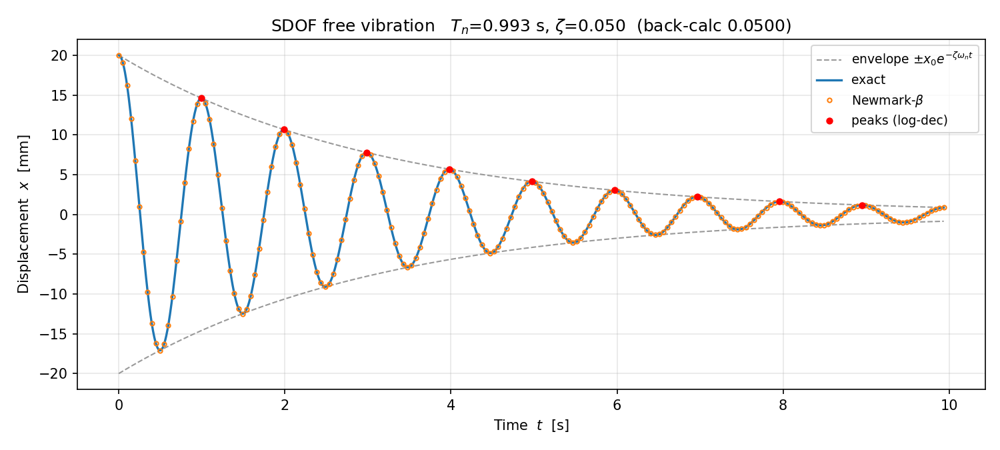

# 예제 1 — SDOF 감쇠 자유진동

```
python sdof_free.py
```

필요 패키지: `pip install numpy matplotlib`

---

## 무엇을 계산하나

```
m*x'' + c*x' + k*x = 0,   x(0) = x0,  x'(0) = v0
```

| 입력 | 값 | 단위 |
| --- | --- | --- |
| 질량 m | 1.0e5 (= 100 ton) | kg |
| 강성 k | 4.0e6 (= 4,000 kN/m) | N/m |
| 감쇠비 ζ | 0.05 | - |
| 초기변위 x₀ | 0.02 (= 20 mm) | m |

## 실행하면 나오는 결과 (검증된 값)

```
  고유각진동수 wn = 6.3246 rad/s
  고유주기     Tn = 0.9935 s
  감쇠고유주기 Td = 0.9947 s   (Tn 보다 0.125% 길다)
  임계감쇠계수 ccr= 1.2649e+06 N*s/m
  감쇠계수     c  = 6.3246e+04 N*s/m
------------------------------------------------------------
[검증 1] Newmark vs 이론해 최대 상대오차 = 0.0606 %
         판정: [PASS]
------------------------------------------------------------
[검증 2] 피크 9개 검출, 5주기 간격 사용
         대수감쇠율      delta = 0.314571
         역산 감쇠비     zeta  = 0.050003  (입력 0.050000)
         상대오차              = 0.0058 %
         판정: [PASS]
```

본인 화면에 이 값이 그대로 나와야 정상입니다. 다르면 코드를 수정한 것입니다.



---

## 이 코드에서 배울 3가지

### ① 단위 방어선 — `assert` 3줄이 하는 일

```python
assert 1e5 < k_N_per_m < 1e10, "k_N_per_m: N/m가 맞는가? (kN/m를 그대로 넣지 않았는가)"
```

`k_N_per_m = 4000` (kN/m를 그대로 넣은 실수)으로 바꿔서 실행해 보세요.
프로그램이 **그 자리에서 멈춥니다.** 이 줄이 없었다면 고유주기 31.4초라는 말도 안 되는 값이
아무 경고 없이 출력됐을 겁니다. 초고층 건물이라면 그럴듯해 보이기까지 합니다.

**동역학 과제 오답의 대부분은 이론이 아니라 단위 환산에서 나옵니다.**

### ② 두 가지 독립 경로로 같은 답을 얻기

- **이론 해석해**: 미분방정식의 닫힌 해
- **수치해**: Newmark-β 평균가속도법 (γ=1/2, β=1/4, 무조건 안정)

둘은 계산 경로가 완전히 다릅니다. 그래서 **둘이 일치하면 양쪽 다 맞을 가능성이 높습니다.**
한쪽만 짜고 "돌아가니까 맞겠지" 하는 것과는 신뢰도가 다릅니다.

> ⚠️ 단, 두 결과가 같다는 것만으로 검증이 끝난 것은 아닙니다.
> **입력값 자체가 틀렸으면** 두 결과가 사이좋게 같이 틀립니다.
> 그래서 검증 2가 필요합니다.

### ③ 결과에서 입력을 역산해 복원하기 (대수감쇠율)

응답 곡선의 연속된 피크 비율로부터 감쇠비를 되짚어 냅니다.

```
δ = (1/n)·ln(xᵢ / xᵢ₊ₙ)          대수감쇠율
ζ = δ / √(4π² + δ²)              감쇠비 역산
```

입력 0.050000 → 역산 0.050003 (오차 0.0058%).
**출력에서 입력이 복원된다는 것**이 코드가 옳다는 가장 강한 증거입니다.
실험실에서 자유진동 시험으로 실제 구조물의 감쇠비를 구하는 방법이 바로 이것입니다.

---

## 직접 해 볼 것

| # | 바꿔 볼 것 | 확인 |
| --- | --- | --- |
| 1 | `zeta = 0.02` / `0.10` / `0.20` | 진폭이 반으로 줄 때까지 몇 주기 걸리나 |
| 2 | `zeta = 0.99` | Td가 Tn보다 얼마나 길어지나. ζ=1이면 왜 식이 깨지나 |
| 3 | `v0_m_per_s = 0.5` | x₀=0, v₀≠0 이면 파형이 어떻게 달라지나 |
| 4 | `pts_per_cycle = 10` | 검증 1이 [FAIL]이 되나. dt가 커지면 무엇이 무너지나 |
| 5 | `k_N_per_m = 4000` | assert가 잡아 주나 |

## Copilot에게 시켜 볼 것

```
이 파일의 newmark_linear 함수 옆에, 중앙차분법(central difference method)으로
같은 문제를 푸는 함수를 추가해 주세요.

조건:
- 함수 시그니처는 newmark_linear와 동일하게
- 안정 조건 dt < Tn/pi 를 assert로 검사할 것
- 세 방법(이론해 / Newmark / 중앙차분)의 최대 상대오차를 표로 출력할 것
```

받은 코드를 그대로 믿지 말고, **`dt`를 키워서 중앙차분이 실제로 발산하는지** 확인하세요.
안정 조건이 조건부라는 것을 눈으로 보는 것이 이 실습의 목적입니다.
