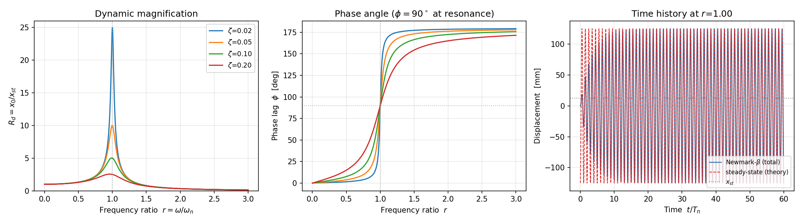

# 예제 2 — 조화하중 정상응답과 공진

```
python harmonic_response.py
```

필요 패키지: `pip install numpy matplotlib`

---

## 무엇을 계산하나

```
m*x'' + c*x' + k*x = p0*sin(w*t)
```

정상상태 해:

```
x_p(t) = (p0/k) · Rd · sin(ωt − φ)

Rd  = 1 / √( (1−r²)² + (2ζr)² )      동적증폭계수
φ   = atan2( 2ζr , 1−r² )            위상각
r   = ω / ωₙ                         진동수비
```

| 입력 | 값 | 단위 |
| --- | --- | --- |
| 질량 m | 1.0e5 | kg |
| 강성 k | 4.0e6 | N/m |
| 감쇠비 ζ | 0.05 | - |
| 하중 진폭 p₀ | 5.0e4 (= 50 kN) | N |
| 진동수비 r | 1.0 (공진) | - |

## 실행하면 나오는 결과 (검증된 값)

```
  Tn = 0.9935 s,  wn = 6.3246 rad/s,  zeta = 0.050
  정적변위 x_st = p0/k = 12.5000 mm
--------------------------------------------------------------
[검증 1] 공진 피크
  수치 탐색   r = 0.9970,  Rd = 10.0120
  이론 정확값 r = 0.9975,  Rd = 10.0125
  간이 근사식 1/(2*zeta)      = 10.0000
  판정: [PASS]
--------------------------------------------------------------
[검증 2] r = 1.00 시간이력 (하중 60주기)
  이론 정상 진폭     = 125.0000 mm  (= x_st x Rd)
  수치 마지막 5주기  = 124.9974 mm
  진폭 상대오차      = 0.0021 %
  위상 지연 phi      = 90.00 deg
  판정: [PASS]
```



---

## 이 코드에서 배울 3가지

### ① 공진에서 무슨 일이 벌어지나

정적으로 50 kN을 걸면 변위는 12.5 mm입니다.
**같은 크기의 하중을 고유진동수로 흔들면 125 mm — 정확히 10배**가 됩니다.

```
ζ = 0.02  →  25.01 배
ζ = 0.05  →  10.01 배
ζ = 0.10  →   5.03 배
ζ = 0.20  →   2.55 배
```

간이 근사 **Rd_max ≈ 1/(2ζ)** 가 여기서 나옵니다.
정확한 최대는 `r = √(1−2ζ²)` 에서 `Rd = 1/(2ζ√(1−ζ²))` 이고,
ζ가 작을수록 근사식과 거의 같아집니다 (ζ=0.05에서 10.0000 vs 10.0125).

> **감쇠비를 5% → 10%로 올리면 공진 응답이 절반이 됩니다.**
> 점성감쇠기(viscous damper) 보강 설계가 "감쇠비 몇 %를 확보할 것인가"를
> 목표로 삼는 이유가 이 한 줄에 들어 있습니다.

### ② 위상각 90°가 뜻하는 것

공진(r=1)에서 응답은 하중보다 정확히 **90° 뒤처집니다.**
이때 하중은 **속도와 위상이 같아지고**, 하중이 하는 일이 전부 감쇠에 소모됩니다.
에너지가 계속 들어가는데 진폭이 무한대로 가지 않는 이유가 감쇠뿐인 상태입니다.

- r ≪ 1 (느린 가진): φ ≈ 0°, 구조물이 하중을 그대로 따라감 (준정적)
- r = 1 (공진): φ = 90°
- r ≫ 1 (빠른 가진): φ ≈ 180°, 질량 관성이 지배해 하중과 반대로 움직임

### ③ 과도응답은 왜 사라지나

시간이력 그래프의 앞부분을 보세요. 처음 몇 주기는 정상해와 다릅니다.
그게 **과도응답(transient)** 이고, `e^(−ζωₙt)` 로 감쇠해 사라집니다.

그래서 검증할 때 **마지막 5주기만** 잘라서 비교합니다.
처음부터 비교하면 멀쩡한 코드가 [FAIL]로 나옵니다.
**무엇을 언제 비교할지 정하는 것도 검증 설계의 일부입니다.**

---

## 직접 해 볼 것

| # | 바꿔 볼 것 | 확인 |
| --- | --- | --- |
| 1 | `r_check = 0.2` | 응답이 정적변위(12.5 mm)에 가까워지나. φ는? |
| 2 | `r_check = 3.0` | 응답이 정적변위보다 작아지나. φ ≈ 180°인가 |
| 3 | `zeta = 0.01` | 공진 증폭이 50배 근처인가. 정상상태 도달에 몇 주기 걸리나 |
| 4 | `n_force_cycles = 5` | 검증 2가 [FAIL]이 되나. 왜 그런가 |
| 5 | `zeta = 0.30` | 공진 피크가 r=1에서 얼마나 벗어나나 (√(1−2ζ²) 확인) |

## Copilot에게 시켜 볼 것

```
이 스크립트에 반감쇠(half-power bandwidth) 방법으로 Rd 곡선에서
감쇠비를 역산하는 함수를 추가해 주세요.

조건:
- Rd 곡선에서 최대값의 1/sqrt(2) 가 되는 두 진동수비 r1, r2를 수치로 찾을 것
- zeta_estimated = (r2 - r1) / (r1 + r2) 로 계산
- 입력 zeta와 비교해 상대오차를 출력하고 [PASS]/[FAIL] 판정할 것
- zeta = 0.02, 0.05, 0.10, 0.20 에 대해 표로 출력
```

**여기서 관찰할 것:** 반감쇠법은 ζ가 작을 때만 정확한 근사입니다.
ζ=0.20에서 오차가 커지는 것이 코드 버그인지 방법 자체의 한계인지 구분해 보세요.
그 구분을 하는 능력이 이 수업에서 기르려는 것입니다.
